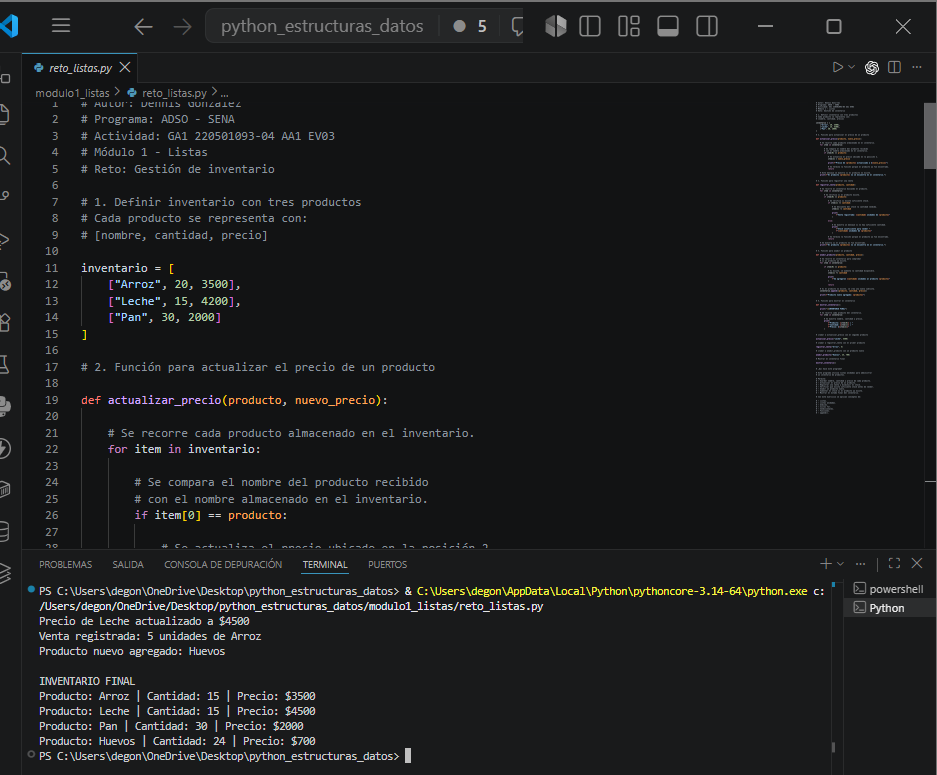
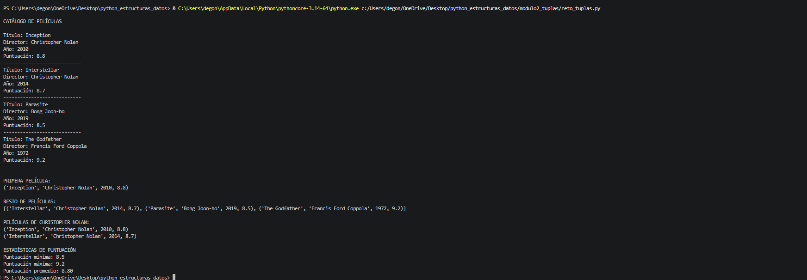
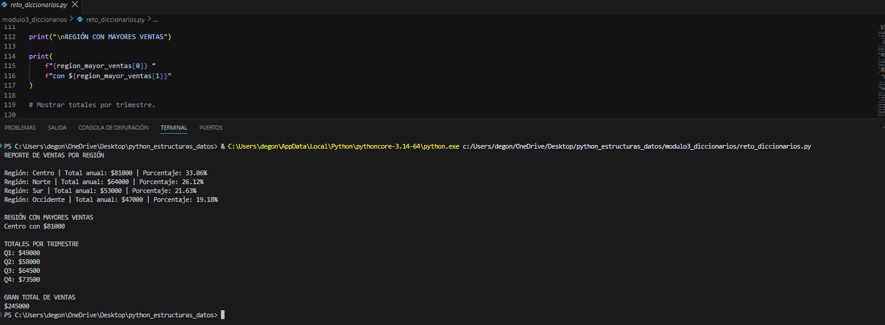
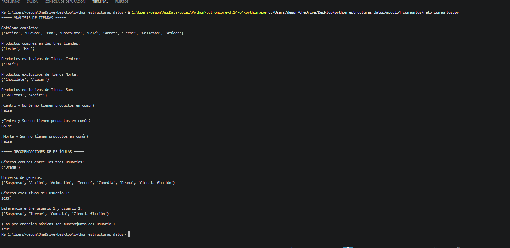
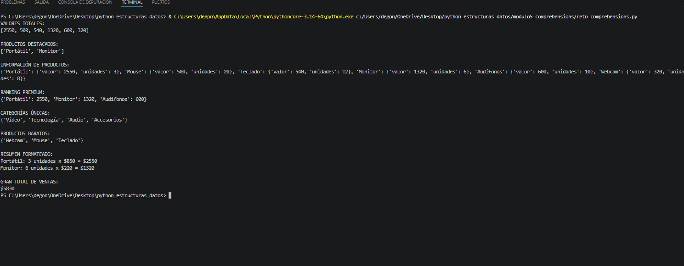

# Fundamentos de Python: Estructuras de Datos

**Autor:** Dennis González  
**Programa de Formación:** Análisis y Desarrollo de Software (ADSO)  
**Actividad:** GA1 220501093-04 AA1 EV03 – Fundamentos de Python: Estructuras de Datos en Python

---

# Descripción del proyecto

Este proyecto fue desarrollado como evidencia de aprendizaje para la actividad **GA1 220501093-04 AA1 EV03**, cuyo propósito es aplicar los conceptos fundamentales de las estructuras de datos en Python mediante ejemplos prácticos y la solución de retos propuestos.

Durante el desarrollo se trabajaron las principales estructuras de datos del lenguaje Python:

- Listas
- Tuplas
- Diccionarios
- Conjuntos (Sets)
- Comprehensions

Cada módulo contiene ejemplos comentados paso a paso y un reto integrador que permite reforzar los conocimientos adquiridos.

---

# Objetivo

Desarrollar un proyecto organizado que permita comprender el funcionamiento de las principales estructuras de datos en Python mediante ejercicios prácticos, retos y buenas prácticas de programación.

---

# Estructura del proyecto

```text
python_estructuras_datos/
│
├── modulo1_listas/
│   ├── ejemplos
│   └── reto_listas.py
│
├── modulo2_tuplas/
│   ├── ejemplos
│   └── reto_tuplas.py
│
├── modulo3_diccionarios/
│   ├── ejemplos
│   └── reto_diccionarios.py
│
├── modulo4_conjuntos/
│   ├── ejemplos
│   └── reto_conjuntos.py
│
├── modulo5_comprehensions/
│   ├── ejemplos
│   └── reto_comprehensions.py
│
├── images/
│
└── README.md
```

---

# Contenido desarrollado

## Módulo 1 - Listas

En este módulo se estudiaron las listas como estructuras de datos ordenadas y mutables.

Se desarrollaron temas como:

- Creación de listas.
- Acceso mediante índices.
- Slicing.
- Métodos para agregar y eliminar elementos.
- Ordenamiento.
- Copias de listas.
- Recorrido mediante ciclos.

**Reto desarrollado:**

- Gestión de inventario utilizando listas anidadas.

---

## Módulo 2 - Tuplas

En este módulo se trabajó con estructuras de datos inmutables.

Se desarrollaron temas como:

- Creación de tuplas.
- Desempaquetado.
- Métodos `count()` e `index()`.
- Tuplas anidadas.
- Conversión entre listas y tuplas.

**Reto desarrollado:**

- Sistema de catálogo de películas.

---

## Módulo 3 - Diccionarios

En este módulo se estudiaron los diccionarios y su organización mediante pares clave–valor.

Se desarrollaron temas como:

- Creación de diccionarios.
- Agregar y modificar información.
- Eliminación de elementos.
- Recorrido mediante `keys()`, `values()` e `items()`.
- Diccionarios anidados.

**Reto desarrollado:**

- Análisis de ventas por región.

---

## Módulo 4 - Conjuntos (Sets)

En este módulo se estudiaron los conjuntos y sus operaciones matemáticas.

Se desarrollaron temas como:

- Creación de conjuntos.
- Agregar y eliminar elementos.
- Unión.
- Intersección.
- Diferencia.
- Diferencia simétrica.
- Conversión entre listas y conjuntos.

**Reto desarrollado:**

- Tiendas y recomendaciones de películas.

---

## Módulo 5 - Comprehensions

En este módulo se aplicó la creación de colecciones mediante comprehensions.

Se desarrollaron temas como:

- List Comprehension.
- List Comprehension con filtros.
- Dict Comprehension.
- Set Comprehension.
- Comprehensions anidadas.

**Reto desarrollado:**

- Analizador de ventas utilizando las tres comprehensions.

---

# Tecnologías utilizadas

- Python 3
- Visual Studio Code
- Git
- GitHub

---

# Evidencias de ejecución

## Reto 1 - Listas



---

## Reto 2 - Tuplas



---

## Reto 3 - Diccionarios



---

## Reto 4 - Conjuntos



---

## Reto 5 - Comprehensions



---

# Reflexión final

El desarrollo de esta actividad permitió fortalecer los conocimientos sobre las principales estructuras de datos en Python y comprender cuándo utilizar listas, tuplas, diccionarios, conjuntos y comprehensions según las necesidades del problema.

Además, la resolución de los retos permitió integrar los conceptos aprendidos mediante ejercicios prácticos, mejorando la lógica de programación, el uso de funciones, estructuras de control y la organización del código.

Finalmente, el uso de Git y GitHub permitió llevar un control de versiones adecuado durante el desarrollo del proyecto, aplicando buenas prácticas en la gestión del código fuente.

---

# Autor

**Dennis González**

**Tecnólogo en Análisis y Desarrollo de Software (ADSO) - SENA**
